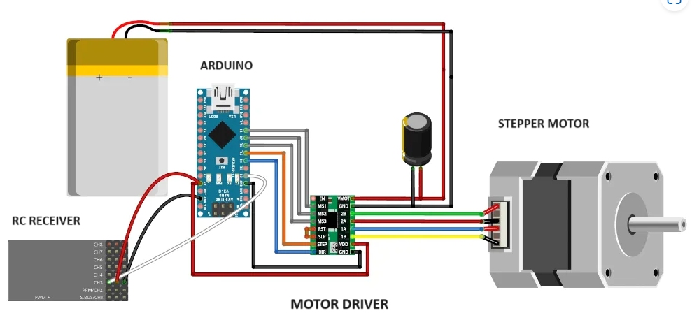

# PWM-to-stepper-motor-
Stepper motor control using the radio control unit(PWM). \

## Components
   - Arduino Nano
   - A4988 Stepper motor driver
   - Stepper motor
   - 100µF capacitor
---------------------
 An example (Video YouTube)
https://youtu.be/CLJJdt-K-O4

----------------------
## Description
OneTurn.ino - only for one turn of the motor

RC_and_Stepper.ino - Unlimited number of motor revolutions
